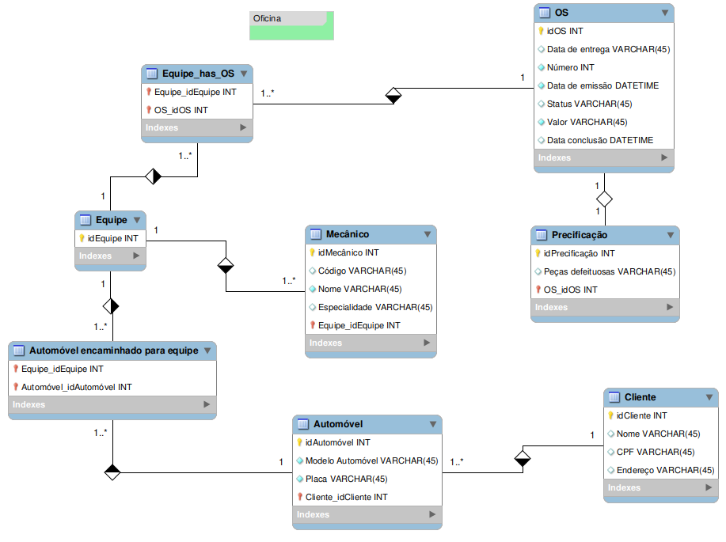

# Modelo de Banco de Dados - Oficina

## Descrição
Este documento apresenta o modelo de banco de dados para um sistema de gerenciamento de oficina mecânica. O modelo foi projetado para gerenciar clientes, veículos, ordens de serviço (OS), equipes de mecânicos e precificação de reparos.

## Diagrama Entidade-Relacionamento

## Principais Entidades

### 1. **Cliente**
- Armazena informações dos clientes que levam veículos para a oficina.
- Relacionado aos automóveis.

### 2. **Automóvel**
- Registra os veículos cadastrados na oficina.
- Cada automóvel pertence a um cliente.
- Pode ser encaminhado para uma equipe para realização de reparos.

### 3. **OS (Ordem de Serviço)**
- Representa um serviço prestado pela oficina.
- Contém detalhes como status, datas de emissão e conclusão, e valor total do serviço.

### 4. **Equipe**
- Responsável pela execução dos serviços.
- Cada equipe pode trabalhar em múltiplas ordens de serviço.

### 5. **Mecânico**
- Representa os profissionais que realizam os serviços nos automóveis.
- Cada mecânico pertence a uma equipe e possui especialidade específica.

### 6. **Precificação**
- Armazena informações sobre peças defeituosas e seus respectivos custos dentro da OS.

## Relacionamentos
- Um cliente pode ter múltiplos automóveis.
- Um automóvel pode estar vinculado a uma ou mais ordens de serviço.
- Uma ordem de serviço pode ser atendida por múltiplas equipes.
- Cada equipe possui vários mecânicos.
- Um mecânico pertence a uma única equipe.

## Considerações Finais
O modelo foi estruturado para garantir um fluxo eficiente de informações dentro da oficina, permitindo a organização e rastreabilidade dos serviços prestados. Caso tenha sugestões de melhorias, sinta-se à vontade para contribuir!

