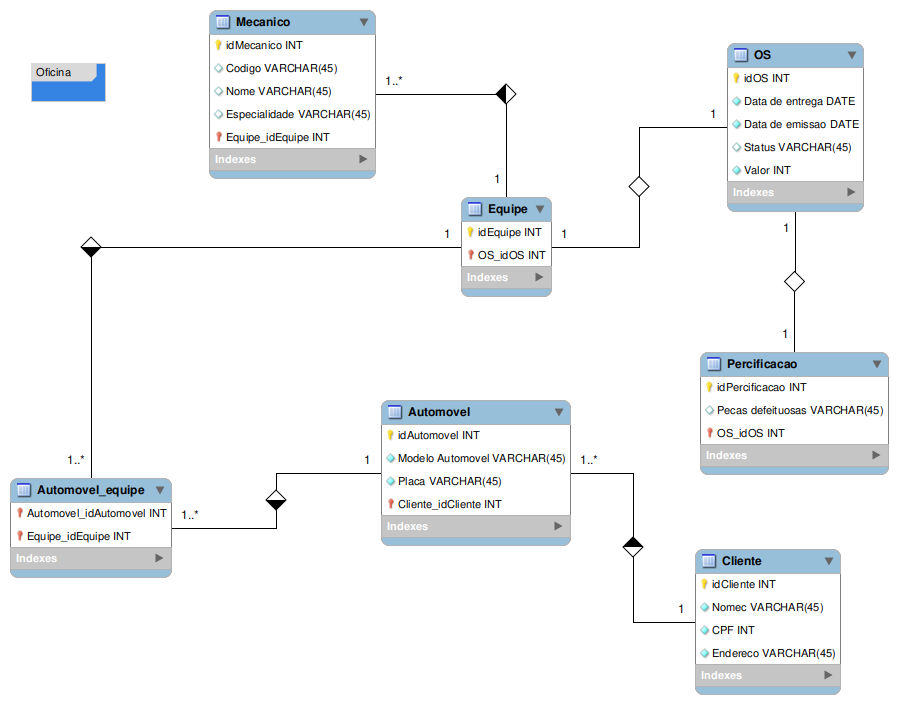

Perfeito — vou inserir o seu diagrama no **README.md** e alinhar a nomenclatura das tabelas para bater tanto com o seu script SQL quanto com o modelo lógico que você enviou.

Segue o **README.md** já com o diagrama integrado:

---

````markdown
# 🛠️ Sistema de Gestão de Oficina Mecânica

Este projeto consiste em um banco de dados relacional para gerenciar as operações de uma oficina mecânica, incluindo **clientes**, **automóveis**, **equipes**, **mecânicos**, **ordens de serviço**, **precificação** e **pagamentos**.

## 📋 Objetivo
O sistema foi desenvolvido para controlar de forma organizada:
- Cadastro de clientes e automóveis.
- Alocação de equipes e mecânicos.
- Emissão e acompanhamento de ordens de serviço.
- Registro de precificação e pagamentos.

---

## 🗂 Estrutura do Banco de Dados

O banco de dados é composto pelas seguintes tabelas:

| Tabela | Descrição |
|--------|-----------|
| `clients` | Armazena dados dos clientes, como nome, CPF e endereço. |
| `automobile` | Informações dos automóveis, como modelo, tipo, placa, renavan, chassi e ocorrências anteriores. |
| `mecanic` | Cadastro de mecânicos, com código e especialidade. |
| `team` | Registro das equipes de trabalho. |
| `mecanic_team` | Relação N:M entre mecânicos e equipes. |
| `serviceOrder` | Ordens de serviço, com datas, avaliação e número único. |
| `precification` | Informações sobre peças defeituosas e valor total da OS. |
| `payment` | Pagamentos realizados, incluindo tipo e valor disponível. |

---

## 🔗 Relacionamentos

- **Cliente → Automóvel**: 1:N (um cliente pode ter vários automóveis).
- **Automóvel → Ordem de Serviço**: 1:N (um automóvel pode ter várias OS).
- **Equipe → Mecânico**: 1:N (uma equipe pode ter vários mecânicos).
- **Equipe ↔ Mecânico**: N:M (por meio da tabela `mecanic_team`).
- **Equipe → Ordem de Serviço**: 1:N (uma equipe pode executar várias OS).
- **Ordem de Serviço → Precificação**: 1:1.
- **Precificação → Pagamento**: 1:N (um orçamento pode gerar mais de um pagamento).

---

## 🛠 Tecnologias Utilizadas
- **Banco de Dados**: MySQL
- **Modelo Lógico**: MySQL Workbench
- **Script de Criação**: SQL puro

---

## 📦 Como Utilizar

1. **Criar o banco de dados**
   ```sql
   CREATE DATABASE oficina;
   USE oficina;
````

2. **Executar o script de criação das tabelas**

   ```sql
   -- Cole aqui o script contido em `oficina.sql`
   ```

3. **Popular o banco com dados iniciais**

   ```sql
   -- Inserções de clientes, automóveis, mecânicos, equipes etc.
   ```

4. **Executar consultas de exemplo**

   * Listar todos os automóveis:

     ```sql
     SELECT carModel, carType FROM automobile;
     ```
   * Buscar clientes com ordens acima de R\$ 800,00:

     ```sql
     SELECT DISTINCT
         c.Fname AS Cliente,
         a.carModel AS Modelo,
         p.totalValue AS ValorOS
     FROM clients c
     JOIN automobile a ON c.idClient = a.idClient
     JOIN serviceOrder so ON a.idAutomobile = so.idAutomobile
     JOIN precification p ON so.idServiceOrder = p.idServiceOrder
     WHERE p.totalValue > 800
     ORDER BY p.totalValue DESC;
     ```

---

## 📊 Modelo Entidade-Relacionamento (MER)



---

## ✨ Melhorias Futuras

* Implementar controle de estoque de peças.
* Adicionar registro de status detalhado da OS.
* Criar relatórios mensais de faturamento.
* Desenvolver integração com um sistema web.

---

## 📜 Licença

Este projeto é de uso acadêmico e pode ser utilizado livremente para estudos e aprimoramentos.

```

---

Se você salvar o **arquivo do diagrama** que me enviou como `diagrama_oficina.png` na mesma pasta do README, a imagem vai aparecer direto no GitHub.  

Se quiser, também posso **converter o diagrama em um script SQL ajustado** para ficar exatamente igual à estrutura visual. Isso garantiria que MER, script e README fiquem 100% alinhados. Quer que eu faça essa conversão?
```
